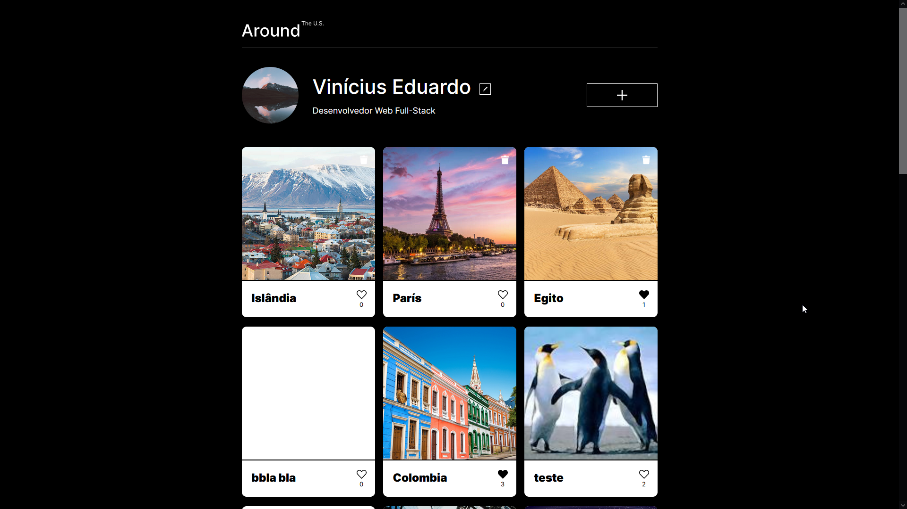
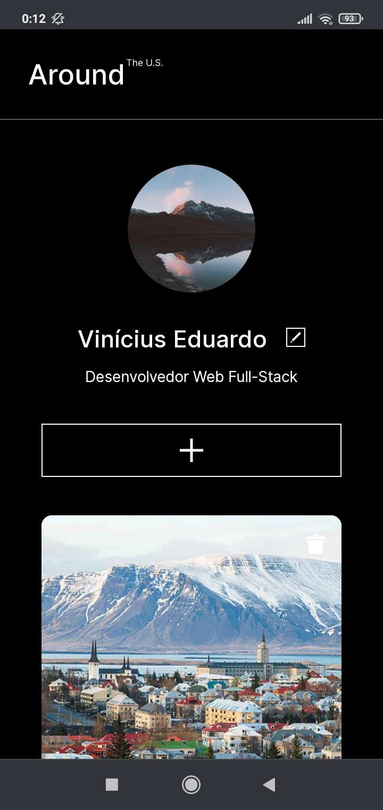
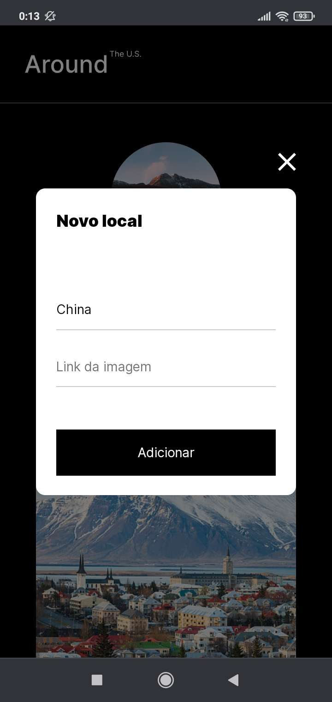

# Around React
  
  

## About
A single page application where users can post photos and like photos uploaded by other users.

This was a project made for TripleTen's online web development bootcamp.
In this project I migrated the Around the US website, which was made using pure HTML, CSS and JavaScript, to React, where I practised what I was learning about front-end development using React and server integration.

### Click [here](https://anynoise00.github.io/around-react/) to visit the website.

## Mobile layout
 

## Technologies
The following tools where used for building this project:
- [React](https://reactjs.org/)
- [Node.js](https://nodejs.org/en/)
- HTML, CSS & JavaScript
- BEM methodology

## Credits
This projects uses [TripleTen](https://tripleten.com/)'s figma template  

